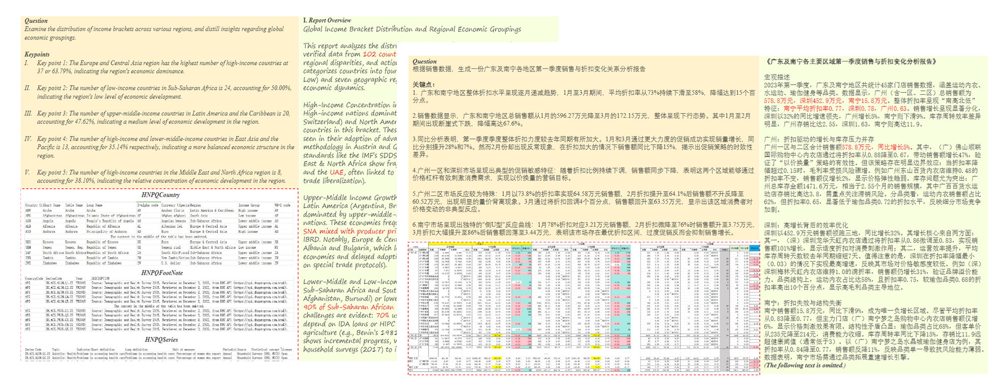
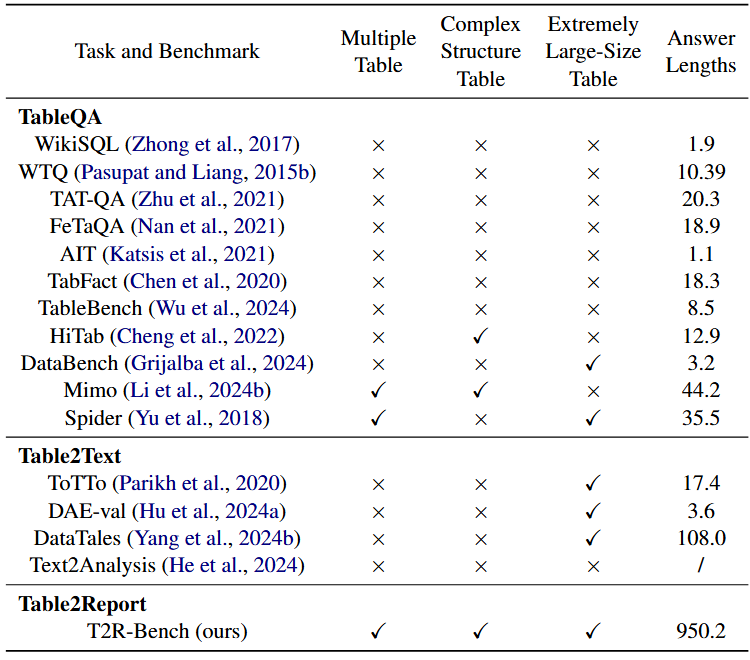
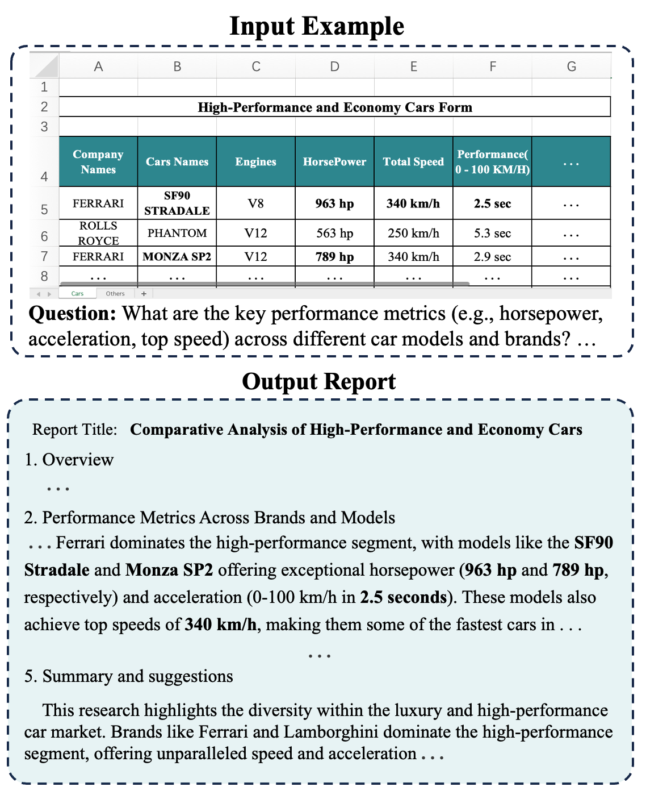
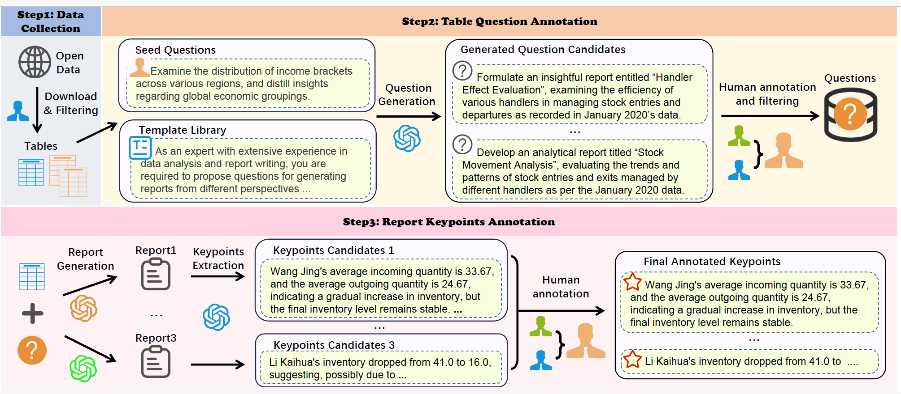

## 概览

欢迎阅读论文T2R-bench: A Benchmark for Generating Article-Level Reports from Real World Industrial Tables的官方仓库。

T2RBench是业内首个面向真实工业场景的“表格生成报告”基准。该数据集包含中英双语场景，共覆盖 6个一级大类和19 个二级业务小类，包括：汽车、能源、金融、政务、财务、科技、教育、银行等垂域。相比于各类开源表格数据集，T2R-bench是业内目前覆盖工业级表格类别最全的数据集，包括多种工业领域特有的复杂表格场景，如单表多sheet、多表多sheet、复杂结构表、超大宽表等，示例如下图所示。

<div align="center">
  
</div>


相比表格领域的已有其他基准（如下表），T2RBench既包含最复杂场景的表格数据，也有最长的答案标准。
<div align="center">
  
</div>

该数据集面向的真实工业场景的“表格生报告”任务，任务示例下图。此任务在工业应用中有广泛需求，如商业智能（BI）、表格分析工具及企业级报告生成等。但表格生报告的系统性研究仍处于探索初期，急需填补空白和提出对应的工业级benchmark。本次开源的数据不仅包含了工业场景的表格数据，还包含了经人工校对的高质量问题和高质量标注的报告关键点（金标准）。表格生报告任务如下：
<div align="center">
  
</div>

其中，数据的整体构建过程和人工核验机制下图。更详细内容请参考我们的论文。由于数据来源于真实工业场景，目前只开源部分高价值数据，全量数据会尽快公开。
<div align="center">
  
</div>
	

## 引用

如果您发现我们的工作有帮助，欢迎使用下面的引用

```bibtext
@misc{zhang2025t2rbenchbenchmarkgeneratingarticlelevel,
    title={T2R-bench: A Benchmark for Generating Article-Level Reports from Real World Industrial Tables}, 
    author={Jie Zhang and Changzai Pan and Kaiwen Wei and Sishi Xiong and Yu Zhao and Xiangyu Li and Jiaxin Peng and Xiaoyan Gu and Jian Yang and Wenhan Chang and Zhenhe Wu and Jiang Zhong and Shuangyong Song and Yongxiang Li and Xuelong Li},
    year={2025},
    eprint={2508.19813},
    archivePrefix={arXiv},
    primaryClass={cs.CL},
    url={https://arxiv.org/abs/2508.19813}, 
}
```
